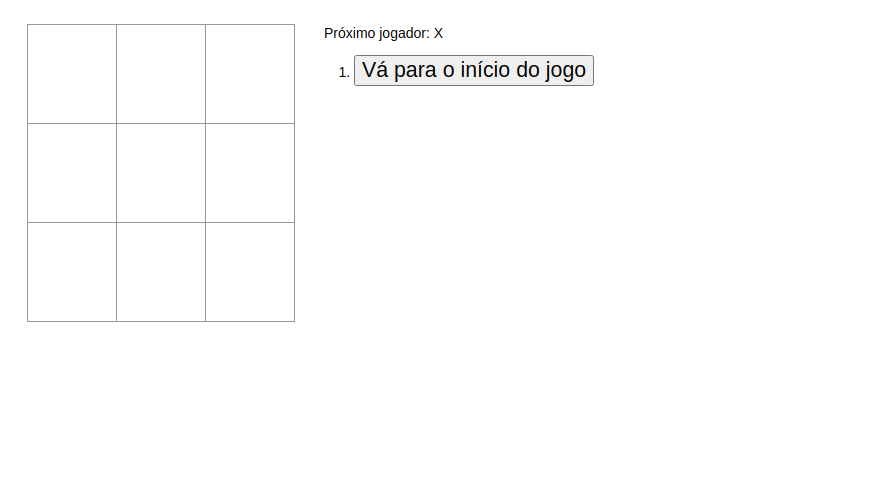
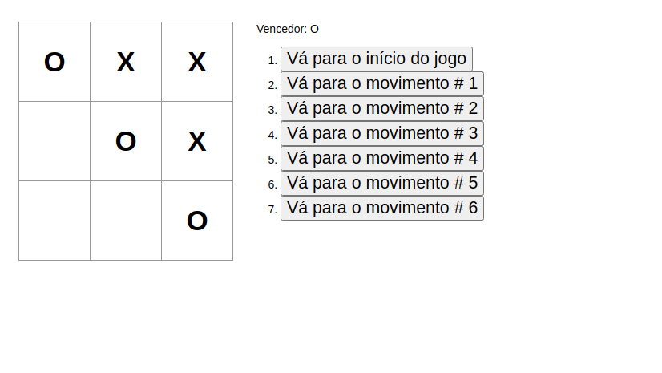

# Jog da velha React

This project was bootstrapped with [Create React App](https://github.com/facebook/create-react-app).

## Para executar esta aplicação

Baixe as dependências com o comando:

### `npm install`

Depois rodar o comando:

### `npm start`

Ou este comando se você estiver usando o yarn.

### `yarn start`

Open [http://localhost:3000](http://localhost:3000) to view it in the browser.

A página será recaregada.

Clicando em `vá para o inicio do jogo`, você começará jogar.

## Finalizando o jogo

Quando o jogador `X` ou `O` ganhar, aparecerá o `Vencedor` na parte superior.

## Conceitos utilizados

Ao longo deste projeto, foi abordado os conceitos de React incluindo elementos, props, e state.
Para mais detalhes sobre estes tópicos, confira [https://pt-br.reactjs.org/docs/hello-world.html](Documentação).

## Tecnologias

React | JavaScript | CSS

